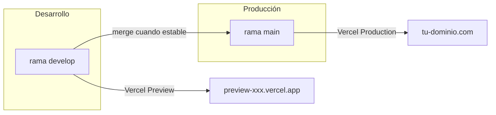

# Plan: Ramas Git, Vercel y gestión de versiones en el CRM

## 1. Estrategia de ramas Git




**Ramas recomendadas:**


| Rama      | Propósito                                 | URL en Vercel                                    |
| --------- | ----------------------------------------- | ------------------------------------------------ |
| `main`    | Versión estable en producción             | Dominio principal (ej. `crm-gemavip.vercel.app`) |
| `develop` | Desarrollo activo, nuevas funcionalidades | URL de preview por commit/rama                   |


**Flujo de trabajo:**

- Trabajas en `develop` para nuevas implementaciones
- Cada push a `develop` genera un **Preview Deployment** con URL única
- Cuando la versión está lista, haces merge de `develop` → `main`
- El push a `main` dispara el **Production Deployment**

---

## 2. Configuración en Vercel

### 2.1 Crear la rama `develop`

```bash
git checkout -b develop
git push -u origin develop
```

### 2.2 Configurar la rama de producción

En **Vercel Dashboard** → tu proyecto → **Settings** → **Git**:

- **Production Branch**: `main` (o la rama que uses actualmente)
- Las demás ramas generan automáticamente Preview Deployments

### 2.3 Variables de entorno por entorno

En **Settings** → **Environment Variables** puedes definir variables distintas para:

- **Production** (solo `main`): BD producción, `APP_BASE_URL` final, etc.
- **Preview** (rama `develop` y otras): BD de pruebas si la tienes, o la misma BD con precaución

---

## 3. Mostrar la versión en el CRM

### 3.1 Fuentes de información de versión

Vercel inyecta automáticamente (si están habilitadas en el proyecto):


| Variable                | Contenido                               |
| ----------------------- | --------------------------------------- |
| `VERCEL_GIT_COMMIT_SHA` | Hash del commit (ej. `a1b2c3d`)         |
| `VERCEL_GIT_COMMIT_REF` | Rama (ej. `main`, `develop`)            |
| `VERCEL_ENV`            | `production`, `preview` o `development` |


Además, [package.json](package.json) ya tiene `"version": "1.0.0"`.

### 3.2 Cambios en el código

**A) Middleware en [api/index.js](api/index.js)** (aprox. línea 284, junto a `res.locals.user`):

```javascript
// Versión para vistas (package.json + info Git en Vercel)
const pkg = require('../package.json');
res.locals.appVersion = pkg.version || '1.0.0';
res.locals.appVersionLabel = process.env.VERCEL_GIT_COMMIT_REF 
  ? `${pkg.version} (${process.env.VERCEL_GIT_COMMIT_REF})` 
  : pkg.version;
res.locals.appCommitSha = process.env.VERCEL_GIT_COMMIT_SHA || null;
```

**B) Mostrar en el header** en [views/partials/header.ejs](views/partials/header.ejs):

Añadir en el `userbox` (o en un footer) un pequeño indicador, por ejemplo:

```html
<span class="version-badge" title="<%= appCommitSha || 'Local' %>">
  v<%= appVersionLabel %>
</span>
```

**C) Endpoint de versión** (opcional, útil para soporte):

```javascript
app.get('/api/version', (req, res) => {
  const pkg = require('../package.json');
  res.json({
    version: pkg.version,
    branch: process.env.VERCEL_GIT_COMMIT_REF || null,
    commit: process.env.VERCEL_GIT_COMMIT_SHA || null,
    env: process.env.VERCEL_ENV || process.env.NODE_ENV || 'development'
  });
});
```

### 3.3 Habilitar variables del sistema en Vercel

En **Vercel** → proyecto → **Settings** → **Environment Variables**:

- Activar **"Automatically expose System Environment Variables"** para que `VERCEL_GIT_COMMIT_SHA` y `VERCEL_GIT_COMMIT_REF` estén disponibles en runtime.

---

## 4. Tabla `versiones` y registro de releases

La tabla [versiones](scripts/crm_gemavip-schema-drawdb.sql) ya existe con campos como `numero_version`, `commit_hash`, `branch_github`, `activa_produccion`, `rollback_disponible`, etc.

**Uso recomendado:**

- Registrar manualmente (o con script) cada release cuando haces merge a `main`
- Ejemplo de inserción al desplegar v1.1.0:

```sql
INSERT INTO versiones (
  numero_version, version_mayor, version_menor, version_revision,
  tipo_version, estable, tag_github, commit_hash, branch_github,
  descripcion, activa_produccion, rollback_disponible, fecha_despliegue
) VALUES (
  '1.1.0', 1, 1, 0, 'release', 1,
  'v1.1.0', 'a1b2c3d...', 'main',
  'Nuevas funcionalidades X, Y', 1, 1, NOW()
);
```

- Actualizar `activa_produccion` de la versión anterior a 0 antes de marcar la nueva como activa

---

## 5. Rollback a una versión anterior

Vercel ofrece **Instant Rollback** sin rebuild:

1. **Vercel Dashboard** → proyecto → **Deployments**
2. Localizar el deployment de la versión a la que quieres volver (por fecha o commit)
3. Menú (⋯) del deployment → **Promote to Production** o **Rollback**
4. En segundos, el dominio de producción apunta a ese deployment anterior

**Importante:** El rollback solo funciona con deployments que ya han servido producción. Los previews de `develop` no son elegibles hasta que se promuevan.

**Alternativa:** Si necesitas volver a un commit concreto en `main`:

```bash
git revert <commit-hash>
git push origin main
```

Esto genera un nuevo deployment; el rollback de Vercel es más rápido porque reutiliza el build existente.

---

## 6. Resumen de pasos


| Paso | Acción                                                                                    |
| ---- | ----------------------------------------------------------------------------------------- |
| 1    | Crear rama `develop` y hacer push                                                         |
| 2    | En Vercel: confirmar Production Branch = `main`                                           |
| 3    | Activar "Automatically expose System Environment Variables" en Vercel                     |
| 4    | Añadir `res.locals.appVersion` y `appVersionLabel` en `api/index.js`                      |
| 5    | Mostrar versión en `header.ejs` (badge o texto discreto)                                  |
| 6    | (Opcional) Endpoint `GET /api/version`                                                    |
| 7    | (Opcional) Proceso/script para registrar versiones en tabla `versiones` al hacer release  |
| 8    | Documentar en README el flujo: `develop` → merge → `main` y cómo hacer rollback en Vercel |


---

## 7. Consideraciones

- **Base de datos:** Si `develop` y `main` comparten la misma BD, ten cuidado con migraciones o cambios de schema. Para desarrollo paralelo seguro, considera una BD de staging para previews.
- **Cache:** Tras un rollback, los usuarios pueden tener cache del frontend; el `?v=2` en los assets de [header.ejs](views/partials/header.ejs) ayuda, pero conviene incrementar ese número en cada release relevante.

