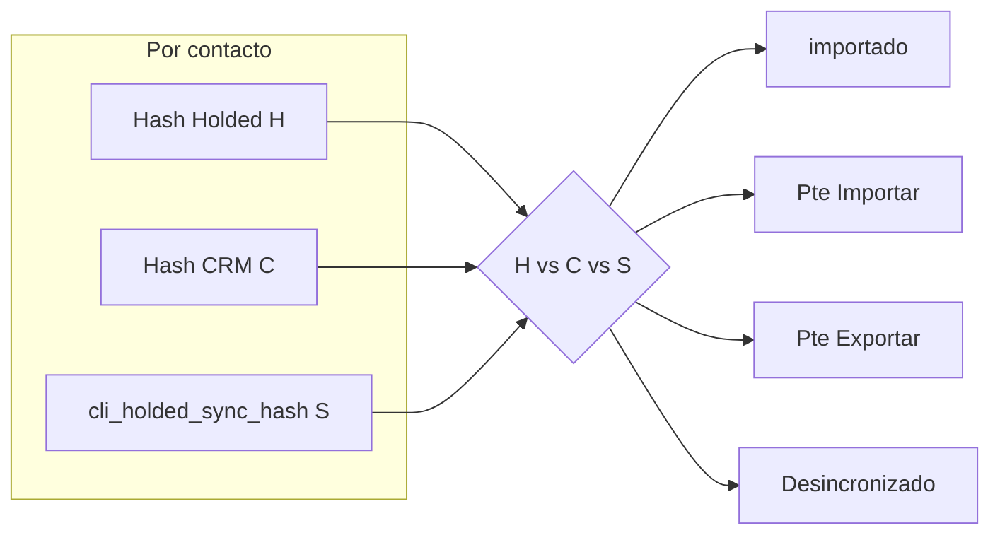

# Plan: Etiquetas sync Holded ↔ CRM (CPanel)

**Estado:** pendiente de implementación (referencia guardada en el repo).

**Resumen:** Añadir detección de sincronización Holded ↔ CRM en la vista previa del CPanel: mostrar «importado» cuando ya está alineado tras importar, «Pte. Importar» cuando Holded ha cambiado respecto al último acuerdo, y «Pte. Exportar» cuando el CRM ha cambiado y Holded sigue igual. Requiere una columna nueva en `clientes` para guardar el hash del último estado acordado y actualizarla al importar (y en el futuro al exportar a Holded).

## Tareas (checklist)

- [ ] Añadir `cli_holded_sync_hash` + script SQL y `config/schema-bd.json`
- [ ] Implementar hash comparable Holded/CRM y `ensureColumn` en `lib/sync-holded-clientes.js`
- [ ] Batch CRM + etiquetas sync + stats; actualizar import (hash + filas `pte_importar`)
- [ ] Corregir `filterPreviewRows` en `routes/cpanel.js` y alinear vista importables con botón
- [ ] Badges y KPIs en `views/cpanel-holded-clientes.ejs`

---

## Contexto actual

- La vista previa asigna [`estado`](views/cpanel-holded-clientes.ejs) `importable` u `omitido` según tags, CIF y provincia ([`buildHoldedPreviewRowsFromList`](lib/sync-holded-clientes.js)).
- Tras importar, una recarga vuelve a mostrar `importable` si el contacto sigue cumpliendo reglas, aunque ya exista en CRM.
- El filtro «Solo omitidos» hoy usa `estado !== 'importable'` ([`filterPreviewRows`](routes/cpanel.js)), lo que **mezclaría** filas realmente omitidas con futuros estados «importado» / «Pte.». Habrá que corregirlo a `estado === 'omitido'`.

## Enfoque de negocio (detección de cambios)

Sin timestamps fiables en `clientes` para «quién editó primero», la forma robusta es un **hash de campos comparables** y un **hash de última sincronización** guardado en BD:

- Tras un **import desde Holded** exitoso: guardar en el cliente `cli_holded_sync_hash` = hash normalizado de los mismos campos que se derivan del contacto Holded (equivalente a lo que usa [`buildClientePayloadFromHoldedContact`](lib/sync-holded-clientes.js) para datos maestros).
- En cada vista previa, para filas que ya tienen cliente CRM enlazado por `cli_Id_Holded` o `cli_referencia` (mismo criterio que el import):
  - `H` = hash desde contacto Holded actual (lista).
  - `C` = hash desde fila CRM (mismas claves normalizadas).
  - `S` = `cli_holded_sync_hash` en BD (último estado acordado; `NULL` si cliente previo a esta feature).

**Etiqueta (solo si la fila sería «importable» en reglas actuales y existe CRM vinculado):**

| Condición | Etiqueta |
|-----------|----------|
| `H === C` (y opcionalmente alinear `S`) | `importado` |
| `S` no nulo, `H !== S` y `C === S` | Holded cambió, CRM aún como en último sync → **Pte. Importar** |
| `S` no nulo, `C !== S` y `H === S` | CRM cambió, Holded como en último sync → **Pte. Exportar** |
| `H !== C` y ambos `H !== S` y `C !== S` | Ambos divergen → **Desincronizado** (o conflicto; texto claro en motivo) |

Si **no** hay fila CRM vinculada y las reglas dan importable → se mantiene **`importable`** (primera importación).

Si `S` es `NULL` (clientes antiguos): si `H === C`, tratar como **importado** y **opcionalmente** rellenar `S` en un `UPDATE` perezoso en la misma petición; si `H !== C`, mostrar **Desincronizado** o inferir con heurística mínima (documentar en código).

## Cambios de código / BD

1. **Script SQL** (p. ej. `scripts/add-column-cli-holded-sync-hash.sql`): `ALTER TABLE clientes ADD COLUMN cli_holded_sync_hash CHAR(64) NULL` (o VARCHAR(64)) + índice opcional por `cli_Id_Holded` si ya existe búsqueda frecuente.
2. **Esquema**: actualizar `config/schema-bd.json` y referencia en docs si el proyecto lo exige para columnas nuevas.
3. **`lib/sync-holded-clientes.js`**:
   - `ensureColumnCliHoldedSyncHash` (mismo patrón que `ensureColumnCliIdHolded`).
   - Funciones puras: `hashComparableHolded(contact, ctxProvPais)` y `hashComparableCrm(clienteRow, ctxProvPais)` usando el mismo conjunto de campos y normalización (trim, mayúsculas donde aplique, fechas ISO).
   - Tras construir filas en `buildHoldedPreviewRowsFromList`, **enriquecer** filas importables con lookup CRM en **batch**: `SELECT` clientes donde `cli_Id_Holded` IN (...) o `cli_referencia` IN (...).
   - Añadir campo de salida p. ej. `syncEtiqueta` o extender `estado` con valores nuevos (`importado`, `pte_importar`, `pte_exportar`, `desincronizado`) **solo** cuando proceda; mantener `omitido` para rechazos por tag/CIF/provincia.
   - Ajustar **stats** en la respuesta (conteos por nueva etiqueta) para los KPIs en la EJS.
   - En `importHoldedClientesEs`: tras `createCliente` / `updateCliente` exitoso, `UPDATE clientes SET cli_holded_sync_hash = ?` con `H` del contacto usado en esa fila.
   - Ampliar criterio de importación: además de `estado === 'importable'`, incluir filas **`pte_importar`** (re-importar desde Holded). No incluir `pte_exportar` ni `importado` en el flujo de import actual (flujo futuro «exportar a Holded»).
4. **`routes/cpanel.js`**: corregir `filterPreviewRows` para que «omitidos» = solo `omitido`; definir vista «importables» como filas con `importable | pte_importar` si se desea alinear con el botón Importar (recomendado).
5. **`views/cpanel-holded-clientes.ejs`**: sustituir el bloque de badge único por ramas para las nuevas etiquetas (clases CSS coherentes con `badge ok / warning / danger`). Actualizar textos de KPIs si se añaden contadores.
6. **Futuro (no obligatorio en este plan)**: al implementar «exportar CRM → Holded», tras `putHolded` exitoso actualizar `cli_holded_sync_hash` con el nuevo estado común para que desaparezca «Pte. Exportar».

## Riesgos / límites

- **Coste**: una consulta batch a `clientes` por vista previa + cálculo de hashes en memoria (aceptable frente a N queries por fila).
- **Plan Vercel**: el tiempo de request ya se optimizó; el batch ayuda. Si el listado Holded es enorme, el cuello de botella sigue siendo el volumen de filas (mismo problema que hoy).
- **Campos comparados**: deben coincidir exactamente entre lo que se escribe en import y lo que se lee del CRM; cualquier transformación en `clientes-crud` (defaults, provincia por CP, etc.) puede hacer que `H !== C` justo después de importar — conviene usar la **misma** función de hash que el payload persistido o re-leer el cliente tras upsert en import para fijar `S` (más fiable que recomputar desde Holded solo).

## Criterio de éxito

- Tras importar y recargar la vista previa, contactos importados muestran **importado** (no «importable»).
- Si se edita el cliente en CRM (campos del hash), aparece **Pte. Exportar** mientras Holded no refleje ese cambio.
- Si se edita el contacto en Holded, aparece **Pte. Importar** mientras el CRM siga con el hash anterior.
- El filtro «Solo omitidos» solo lista rechazos por reglas de negocio, no filas sincronizadas.
